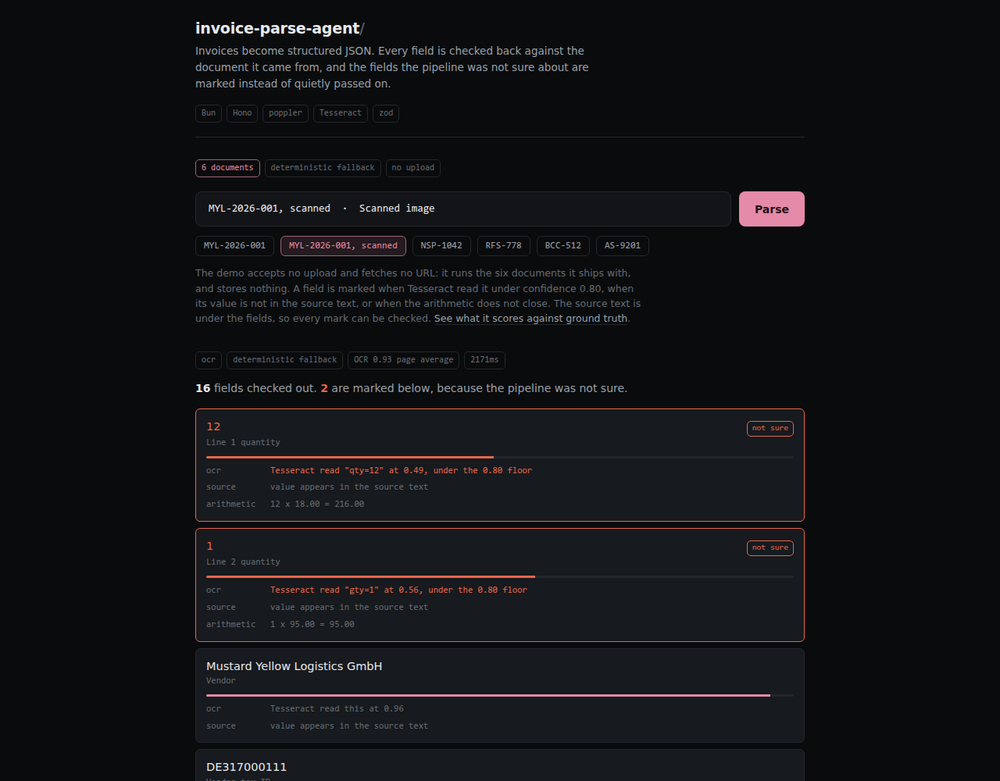

# invoice-parse-agent

Invoices become structured JSON, and every field is checked back against the document it came from, so the ones the pipeline was not sure about are marked instead of quietly passed on.

**Live:** <https://invoice-parse-agent-production.up.railway.app> · **Stack:** Bun · Hono · poppler · Tesseract · zod



## What it does

A document arrives as a PDF or an image. A born-digital PDF has its text layer read directly; a scan is rasterized with `pdftoppm` and read by Tesseract. The text goes to a schema-constrained extractor, and zod rejects anything that does not fit the invoice schema, so malformed output fails at the boundary instead of entering an accounting workflow.

An extractor returns a value for every field whether or not the document supports one, and a field it guessed looks exactly like a field it read. So each field is put through three checks that a reader can re-run:

- **ocr**: the lowest confidence Tesseract reported for the words carrying that value. Below 0.80, the field is marked. This runs only where OCR ran, because a born-digital PDF has no OCR doubt to report.
- **source**: whether the value is present in the source text, matched on digit boundaries so a quantity of 9 is not "found" inside a tax ID ending in 900.
- **arithmetic**: whether quantity × unit price equals the line total, and whether the lines plus tax equal the invoice total.

A field failing any of them is marked. The source text is printed under the fields, so a visitor can check every mark themselves. There is deliberately no per-field score from the model: a number an extractor invents about its own output cannot be checked by anyone.

The three checks are independent, and they catch different things. On the bundled scan, Tesseract misreads `qty=1` as `gty=1` and reports 0.56 on it; the value survives anyway, and the arithmetic still closes, so only the confidence check objects. Rasterize the same invoice more aggressively and the quantity is genuinely lost, the confidence check misses it, and the arithmetic catches it instead: `1 x 18.00 != 216.00`.

## Architecture

```text
POST /demo/parse  {id}            the public demo: six bundled documents, nothing else
  -> pdf-parse            text layer, if the PDF has one
  -> pdftoppm + Tesseract otherwise: rasterize, then OCR with per-word confidence
  -> extractor            Claude Haiku 4.5 when ANTHROPIC_API_KEY is set,
                          a deterministic regex extractor when it is not
  -> zod                  schema boundary; invalid output fails here
  -> evidence             per field: ocr · source · arithmetic  -> verified | flagged
  -> JSON + the raw source text

POST /parse                       the operator surface, sealed unless DEMO_MODE=false
  takes a URL or an upload, persists every parse to SQLite, feeds a review queue
  at GET /dashboard where low-confidence parses are corrected by hand

GET /eval                         5 fixtures against ground truth, 67 fields
```

## Verification

| What | Value | When |
|------|-------|------|
| Tests | 34 pass, 0 fail | 2026-07-14 |
| Eval, field hit rate | 67/67 fields, 1.000 (deterministic extractor) | 2026-07-14 |
| Scan, page OCR confidence | 0.93 | 2026-07-14 |
| Scan, fields marked | 2 of 18, both line quantities | 2026-07-14 |
| Same invoice, born-digital PDF | 0 of 18 marked, no OCR | 2026-07-14 |
| Image size | 123 MB | 2026-07-14 |

Reproduce the whole set with `bun test` and `bun run eval`. The marking is reproducible from the container alone:

```bash
docker build -t invoice-parse-agent .
docker run --rm -p 8787:8787 invoice-parse-agent
curl -s -X POST http://localhost:8787/demo/parse \
  -H 'content-type: application/json' -d '{"id":"mustard-logistics-001-scan"}'
```

The build itself runs OCR on a bundled scan and fails if it cannot, so an image that builds is an image whose OCR works. It also caches the language data, which means the container reads documents with no network at all: `docker run --network none` still parses the scan.

## Limits

- **The eval number is a regression guard, not a measurement of invoice extraction.** Five synthetic fixtures, read by a regex extractor written for exactly that layout, score 1.000 because they were built to. It tells you the pipeline still works; it tells you nothing about a real vendor's invoice.
- **The demo accepts no upload and fetches no URL.** A public parse endpoint would fetch any URL it was handed, OCR any bytes it was handed at someone else's cost, and persist a stranger's invoice where the next visitor could read it. Those routes exist and are the point of the tool, and they are sealed in demo mode. Self-host and set `DEMO_MODE=false` to use them.
- **Without `ANTHROPIC_API_KEY`, a regex extractor runs, not a model.** The console names whichever one produced the fields, so the page cannot claim a model it did not use. The screenshot above shows the fallback path.
- **The `source` and `arithmetic` checks are weak on short numbers.** A quantity of 1 appears in almost any document, and 1 × 95 = 95 closes trivially. The checks are strongest where the values are distinctive.
- **The corpus is synthetic and English.** No real company, invoice, or person is in it. All five tax IDs deliberately fail their country's VAT checksum, so none of them can belong to a real business. Line items, layouts, and vendors are invented.
- **Six documents is not a document-understanding benchmark.** Handwriting, rotated scans, multi-page invoices, and table-heavy layouts are untested here.
- **Scale-to-zero means a cold start.** The first visitor after a period of quiet waits for the container to wake.

## Run it locally

```bash
bun install
bun run demo    # the public console at :8787, upload and job routes sealed
bun run dev     # the full operator surface: upload, review queue, dashboard
```

`bun run dev` sets `DEMO_MODE=false`. Optional: `ANTHROPIC_API_KEY` for model extraction, `QDRANT_URL` for invoice memory across parses.

## License

MIT
